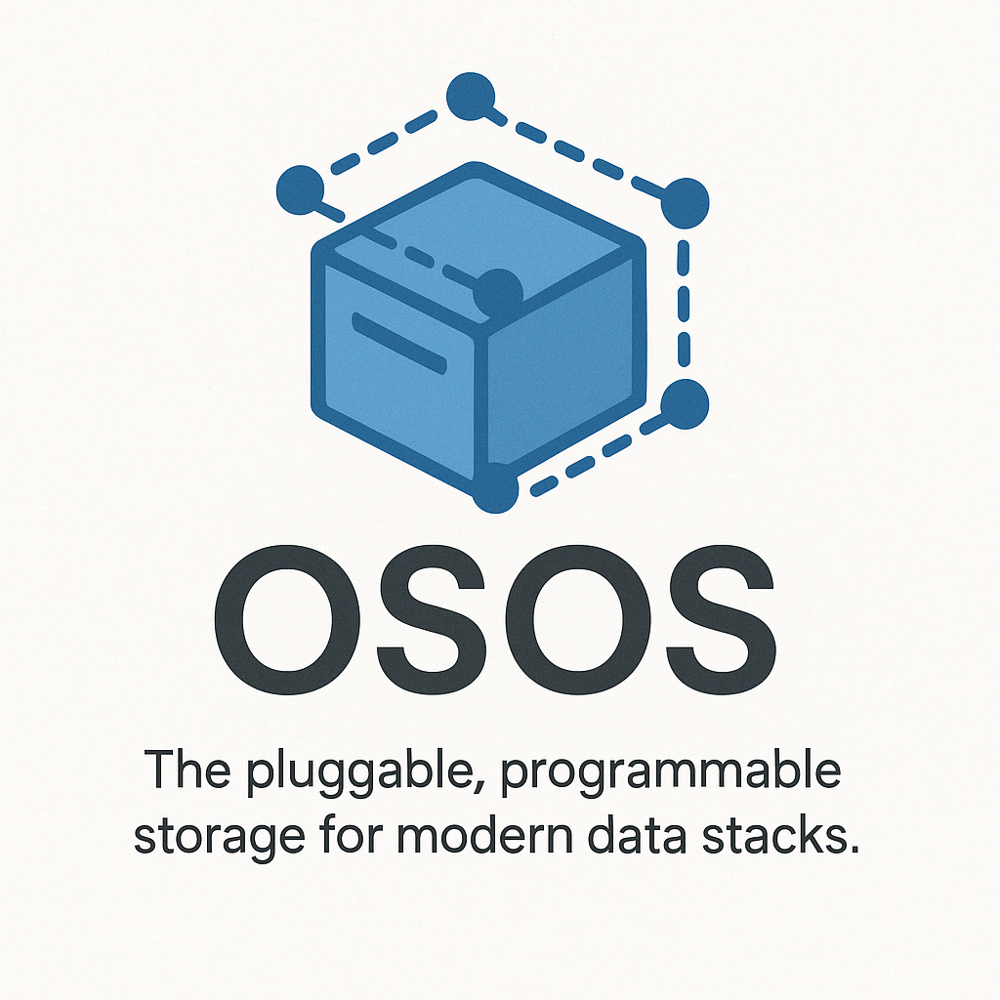

# onestack-osos

  

<h1 align="center">OSOS – OneStack Object Store</h1>

<i>The pluggable, programmable storage for modern data stacks.</i>

Open Source Object Storage API – konfigurierbar, sicher und OneStack-kompatibel
